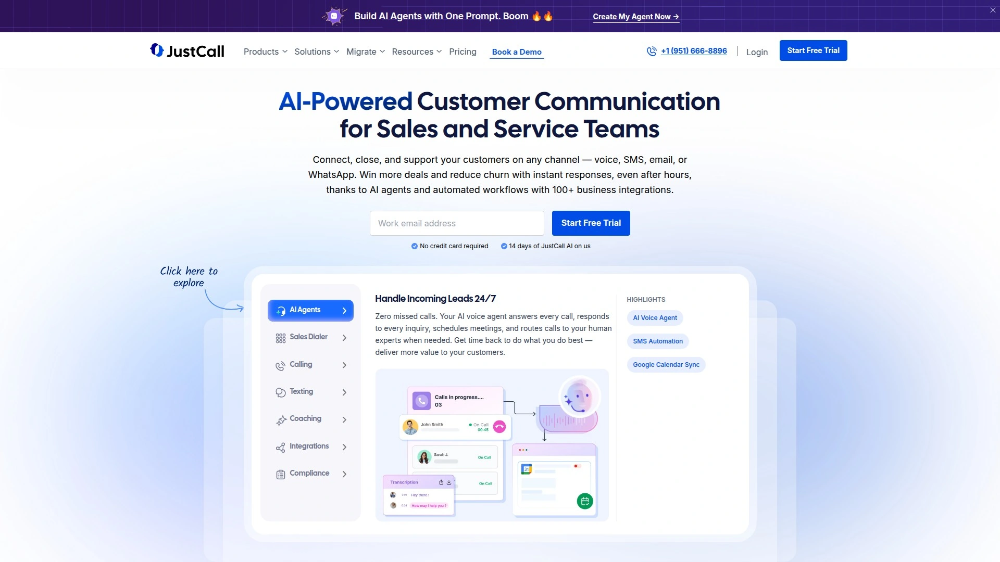

# 学会使用这12个云呼叫中心软件，五分钟搞定全球业务通话

传统电话系统部署成本高、扩展困难、数据孤岛严重——这些痛点正在阻碍企业快速响应客户需求。云呼叫中心与VoIP商务电话系统的出现，让销售团队、客户支持部门、远程办公团队能以更低成本实现全球通话、智能路由、实时分析与CRM深度集成。无需购买昂贵硬件，无需复杂IT维护，只需浏览器或移动应用即可接入专业级通信能力。本文精选12家技术成熟、功能完善的云通信平台，从AI智能外呼、全渠道客户互动到企业级安全合规，全方位解析各平台核心竞争力，帮助你在最短时间内找到最契合业务场景的通信解决方案。

---

## **[CloudTalk](https://www.cloudtalk.io)**

为销售与客服团队打造的AI驱动全球通话平台，效率提升神器。

CloudTalk专注于帮助销售、客服、运营与招聘团队通过人工或AI语音代理处理高频次客户沟通。平台最大亮点是AI并行拨号器（Parallel Dialer）与语音信箱检测技术，让团队联系客户数量提升10倍，90%的代理通过Power Dialer节省大量手动拨号时间。自动化呼叫分发、智能条件路由、呼叫队列等功能确保每通来电都能准确抵达最合适的座席。

**全球覆盖能力突出**：支持160多个国家的国际号码，配合WhatsApp与国际短信功能，帮助企业触达不接听电话的客户群体。实时分析仪表板、座席绩效报告、通话监控与旁听功能让管理者全面掌控团队表现。100多种第三方集成（Salesforce、HubSpot、Zendesk等）消除数据孤岛，自动同步通话记录至CRM系统。

定价透明且灵活：Lite计划$25/月起提供基础功能，Starter与Expert计划分别提供无限欧盟/英国通话与高级路由能力。DentaKay案例显示，实施Power Dialer后8个月内呼叫量增长150%。适合需要大规模外呼的销售团队、处理咨询高峰的客服中心、跨国运营的远程团队。

***

## **[Talkroute](https://talkroute.com)**

极简虚拟电话系统，创业公司与小团队的性价比首选。

Talkroute主打轻量级部署体验，无需购买硬件设备即可为企业配置专业商务电话。用户可从办公室、家中或移动设备接听客户来电，所有功能整合在单一应用内。提供本地号码、800免费号码与虚拟号码等多种选项，支持呼叫转移、语音信箱转文字、视频会议、团队短信等核心功能。

界面设计简洁直观，新用户10分钟内即可完成配置并开始接听电话。价格实惠且透明，适合预算有限的初创企业与自由职业者。客户反馈普遍称赞其稳定性与易用性，技术支持响应及时。

**推荐场景**：5人以下小型团队、需要商务形象的自由职业者、预算敏感的初创公司、临时项目组。平台简化了传统电话系统的复杂性，让非技术背景用户也能快速上手。90天跟踪窗口与低门槛让推介者更容易获得认可。

***

## **[Aircall](https://aircall.io)**

专为远程团队设计的轻量级云电话，集成能力超强。

Aircall以其对现代SaaS工作流的深度适配而闻名，特别受远程优先公司与分布式团队欢迎。平台核心优势在于丰富的集成生态——与Salesforce、HubSpot、Intercom、Slack、Zendesk等100多个工具无缝连接，通话数据自动同步至业务系统。点击拨号、屏幕弹窗显示客户信息、通话后自动记录等功能大幅提升工作效率。

用户界面现代化，移动端应用功能完整，让销售与客服团队无论身处何地都能保持专业通信能力。实时通话监控、智能呼叫路由、IVR语音菜单、团队协作功能一应俱全。通话录音自动存档，便于质量审核与培训。

**定价策略**：按座席订阅，透明计费无隐藏费用。14天免费试用让团队充分评估适配度。Forbes与TechCrunch等媒体多次推荐为远程团队最佳选择。适合技术驱动的销售团队、SaaS公司客服部门、需要工具深度集成的增长型企业。用户推荐可获得激励，完成演示即有回馈。

***

## **[Dialpad](https://dialpad.com)**

AI原生设计的统一通信平台，实时转录与智能洞察引领行业。

Dialpad从诞生之初就将AI能力融入产品基因，其Voice Intelligence技术可实时转录通话内容、识别关键时刻、提取行动项、分析客户情绪。座席在通话过程中即可看到AI生成的实时建议与知识库推草，显著缩短新人培训周期。通话结束后自动生成结构化摘要，管理者无需听完整录音即可掌握关键信息。

**全渠道统一**：将语音通话、视频会议、团队消息、短信整合在单一应用，员工无需在多个工具间切换。与Google Workspace、Microsoft 365、Salesforce等企业级系统深度集成。移动优先设计让外勤销售与远程员工获得与桌面端一致的体验。

安全与合规能力突出，符合HIPAA、SOC 2、GDPR等标准，适合医疗、金融等监管严格行业。推荐激励机制慷慨：完成演示获$100，成交11座席以上可获$500-$5000不等奖励。适合AI赋能需求强烈的现代化企业、需要实时辅导的客服中心、多地协同的分布式团队。

***

## **[JustCall](https://justcall.io)**

专为中小企业优化的全功能云呼叫中心，移动端表现优异。

JustCall在保持功能完整性的同时，特别注重中小团队的使用体验与成本控制。平台提供本地与国际号码、自动拨号器（预览/渐进/预测模式）、通话录音、短信群发、IVR、实时监控等企业级功能，但价格显著低于RingCentral、Five9等大厂产品。移动应用获AppStore与Google Play高分评价，外勤销售团队特别依赖其稳定的移动通话质量。

**集成便捷**：支持HubSpot、Pipedrive、Zoho、Freshdesk等主流CRM与客服工具，数据双向同步减少手动录入。AI通话摘要、情感分析、通话评分等智能功能帮助管理者快速识别培训需求。客户反馈称其性价比在同类产品中最具竞争力。

适合预算有限但功能需求全面的创业公司、需要移动办公能力的销售团队、寻求RingCentral平价替代的中型企业。G2评分4.3/5，用户普遍称赞其客户支持响应速度与产品稳定性。

***

## **[8x8](https://8x8.com)**

全球化部署的统一通信巨头，企业级稳定性与安全性标杆。

8x8服务超过100万企业用户，在全球拥有分布式数据中心确保99.999%服务可用性。平台将语音、视频、聊天、联络中心整合为单一解决方案，特别适合需要全球一致性通信体验的跨国企业。支持48种语言的IVR、智能路由、全渠道客服、语音分析、座席桌面集成等高级功能。

**合作伙伴体系成熟**：提供经销商、技术集成、推荐等多种合作模式，渠道伙伴可获专属工程团队支持、培训资源、市场材料。推荐计划单线路可获$100奖励，单笔最高达$15000。与Salesforce、Microsoft Teams、Google Workspace等70多个系统深度集成。

Gartner多次将8x8列入统一通信魔力象限领导者位置。适合500人以上大中型企业、有严格合规要求的金融医疗行业、需要全球号码资源的跨国公司。价格属于中高端定位，但稳定性与功能深度物有所值。

***

## **[Vonage](https://vonage.com)**

通信API先驱者，可编程性与灵活性业界顶尖。

Vonage不仅提供开箱即用的商务电话系统，更以其Communication API闻名——开发者可将语音、短信、视频、验证码等通信能力嵌入任何应用。对于需要定制化通信功能的SaaS公司、电商平台、在线服务商，Vonage API可快速实现点击拨号、一键呼叫客服、订单短信通知等场景。

**商务电话产品线**：Mobile计划$14.99/月起适合个人与微型团队，Premium与Advanced计划提供多级自动话务员、CRM集成、群组通话、可视语音信箱等高级功能。无限通话覆盖美国加拿大，国际套餐可选。应用中心提供丰富扩展插件。

作为Ericsson旗下品牌，技术实力与资金储备雄厚。适合需要通信API能力的开发型企业、追求灵活扩展的成长公司、需要稳定国际通话的出口导向企业。合作伙伴计划支持经销商与技术集成商多种模式。

***

## **[Five9](https://five9.com)**

企业级联络中心领导者，AI与自动化能力深厚。

Five9专注于中大型企业联络中心场景，提供预测式外呼、全渠道路由、劳动力管理、质量监控、绩效分析等完整WFM与WFO解决方案。其AI引擎覆盖智能IVR、情感分析、座席辅助、预测性分析等多维度，帮助企业将首次解决率提升20%以上、平均处理时长缩短15%。

**行业解决方案丰富**：针对金融、医疗、零售、政府等垂直领域提供合规预配置模板。与Salesforce、ServiceNow、Zendesk等企业级系统原生集成。云架构确保弹性扩容，应对呼叫高峰无需提前采购硬件。

Gartner连续多年评为联络中心即服务领导者。推荐计划提供15%许可费用奖励，持续2年。适合100座席以上的大型客服中心、需要复杂路由与WFM的BPO公司、追求AI驱动效率提升的企业。价格不公开透明，需联系销售获取报价。

***

## **[VoiceSpin](https://voicespin.com)**

深耕VoIP领域19年的专业玩家，终身奖励机制独特。

VoiceSpin以其AI语音分析器、全渠道消息统一、云呼叫中心软件三大核心产品服务电商、房地产、保险、医疗等行业客户。平台特别强调数据安全与行业合规，通过多项国际认证。提供白标选项让渠道伙伴以自有品牌转售服务，创造差异化竞争优势。

**合作模式灵活**：推荐者、经销商、分销商三类计划满足不同业务目标。最大特色是终身经常性奖励——只要被推荐客户持续使用，推荐者即可按季度获得MRR百分比回报，而非一次性支付。专属成长经理提供销售支持，Tier 1技术培训让合作伙伴团队具备独立支持能力。

适合已有客户基础的IT服务商、寻求被动收入来源的咨询顾问、希望增加产品组合的通信经销商。15年以上市场历史证明其技术可靠性与商业稳定性。24/7技术支持确保合作伙伴无后顾之忧。

---

## **[Grasshopper](https://grasshopper.com)**

专为创业者与自由职业者设计的虚拟电话系统，让小企业更专业。

Grasshopper主打"让手机变身商务电话"理念——用户保留个人手机号隐私，通过专属商务号码对外展示专业形象。来电可智能转接至手机、座机或任何设备，客户永远拨打统一商务号码。虚拟总机、定制问候语、多分机管理让一人公司也能呈现团队规模感。

**操作极度简化**：无需安装硬件，5分钟内完成在线注册即可使用。移动应用功能完整，随时随地接听商务电话、收发商务短信、查看语音信箱。Entrepreneur、Forbes等创业媒体频繁推荐为小企业电话系统首选。

合作模式多样：战略推荐、市场合作伙伴、经销商、连锁加盟等选项覆盖不同合作深度。被推荐客户获专属折扣，推荐者按成交获奖励。适合1-10人微型企业、自由职业者、顾问工作室、本地服务商（水暖、维修、清洁等）。价格$14-$80/月，无长期合约束缚。

***

## **[Aloware](https://aloware.com)**

CRM原生集成的AI联络中心，电商与本地服务业最爱。

Aloware深度整合HubSpot、Salesforce、Pipedrive等顶级CRM系统，让销售与客服团队直接在CRM界面拨打电话、发送短信、查看通话历史。AI驱动的联络中心效率工具包括智能路由、通话录音分析、座席活动追踪等，帮助企业缩短响应时间、提升转化率。

**行业针对性强**：特别受电商卖家、房地产中介、汽车经销商、家庭服务商青睐，这些行业客户高频使用CRM且对通话效率敏感。SMS营销功能支持批量发送与自动化触发，配合语音通话形成完整客户触达方案。

推荐奖励机制慷慨，最高可获30%经常性回报。合作伙伴将客户引荐给Aloware的AI驱动联络中心解决方案后，可长期获益。适合CRM深度用户、多渠道营销团队、需要SMS与语音结合的销售组织。G2用户评分显示其在易用性与客户支持方面表现优异。

***

## **[3CX](https://3cx.com)**

开放标准的私有化部署专家，Avaya与Mitel的平价替代。

3CX基于SIP与WebRTC开放协议构建，让企业摆脱专有硬件绑定，自由选择IP话机、SIP中继、部署环境。可部署在Windows、Linux、云端（AWS/Azure/Google）或由3CX托管，灵活性极高。内置视频会议、实时聊天、CRM集成功能无需额外付费，大幅降低总体拥有成本。

**IT管理员友好**：无需电信专业知识，有IT基础即可配置管理。预配置SIP中继与IP话机模板简化初始部署。相比Avaya每用户每功能收费模式，3CX采用一次性许可证定价，200座席以上企业成本优势明显。

渠道合作伙伴计划完善，提供销售培训、技术认证、市场支持。适合需要私有化部署的中大型企业、成本敏感的制造业与教育机构、从Avaya/Mitel迁移的用户、IT能力强的技术型组织。全球超过60万家企业安装量证明其成熟度与可靠性。

***

## 常见问题

**云呼叫中心与传统电话系统的核心区别是什么？**

云呼叫中心基于互联网运行，无需购买PBX硬件与电话线路，仅需电脑或手机即可使用，部署周期从数周缩短至数小时。成本结构从高额前期投资转变为可预测的月度订阅，座席数量可随业务波动灵活增减。云平台天然支持远程办公，员工在家中也能接听公司电话。数据集中存储于云端，通话记录、录音、分析报告随时随地访问。自动更新功能让企业持续获得最新特性，无需IT部门手动升级维护。

**如何评估不同云通信平台的性价比？**

单纯比较月费容易忽略隐藏成本。需综合考量：基础套餐包含哪些功能（部分平台IVR、录音、集成等需额外付费）、国际通话资费（按分钟计费还是包月无限）、超出套餐限额的增量成本、合约期限与退出条款、实施与培训费用。小团队优先易用性与快速部署，大企业关注高级路由、劳动力管理、合规认证。试用期内测试实际使用场景（如CRM集成流畅度、移动端稳定性、通话音质），邀请座席与管理者共同评估。查看G2、Capterra等第三方评价平台的真实用户反馈，警惕全五星或全一星的极端评价。

**中小企业选择云呼叫中心需要注意哪些坑？**

过度采购是最常见错误——许多高级功能（如预测式外呼、劳动力优化）仅适合50座席以上团队，小企业支付这些功能费用却从未使用。合约锁定风险同样值得警惕，部分供应商要求年度预付且提前终止收取高额罚金。数据迁移困难导致供应商锁定，选择前确认通话记录、录音、联系人等数据可导出标准格式。客户支持质量差异巨大，便宜方案可能仅提供邮件支持，紧急故障时无法及时响应。国际通话陷阱常见于"无限通话"套餐，仔细阅读条款确认是否包含目标国家。建议从基础计划起步，根据实际需求逐步升级，避免功能过剩浪费预算。

***

## 总结

从AI驱动的智能外呼到全球无缝通信，这12款云呼叫中心平台各具特色。如果你的销售与客服团队需要在全球范围内高效触达客户，同时希望通过AI自动化大幅提升通话效率，[CloudTalk](https://www.cloudtalk.io)凭借其Power Dialer让90%座席节省拨号时间、AI并行拨号器实现10倍联系量增长、160国际号码覆盖与100+CRM集成能力，特别适合需要大规模外呼的B2B销售团队、处理咨询高峰的客户服务中心、以及跨国运营的远程协作团队使用。对于预算有限的初创企业，Talkroute与Grasshopper提供极简部署体验；需要AI实时转录与智能洞察的现代化企业应关注Dialpad；追求企业级稳定性的大型组织可选8x8或Five9；而寻求私有化部署控制权的技术型企业则会欣赏3CX的开放架构。选型时务必明确座席规模、核心使用场景（内呼/外呼/全渠道）、集成需求与预算范围，充分利用免费试用期测试实际工作流适配度，避免功能过剩或不足导致的投资浪费。
